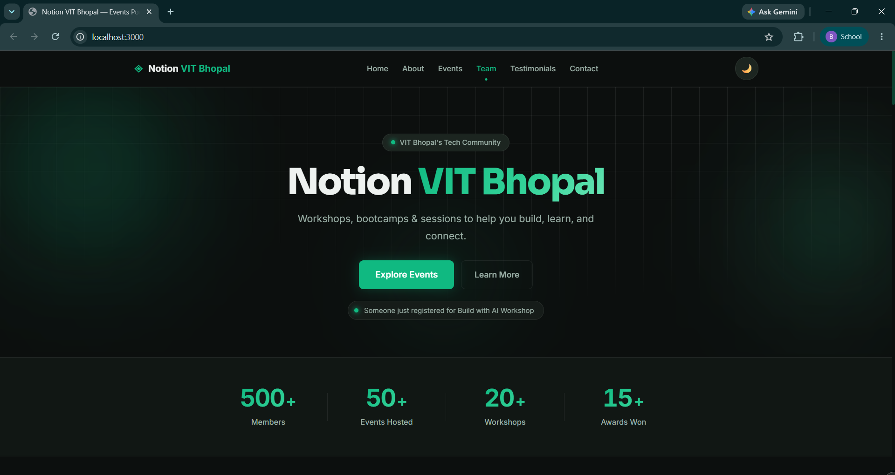
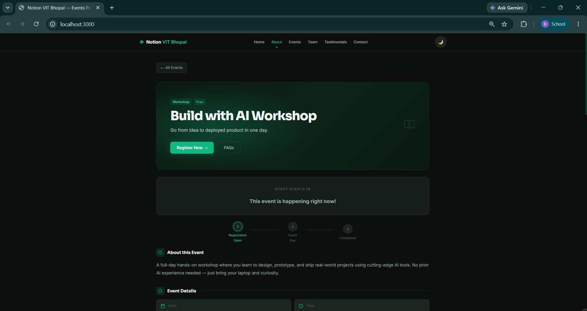
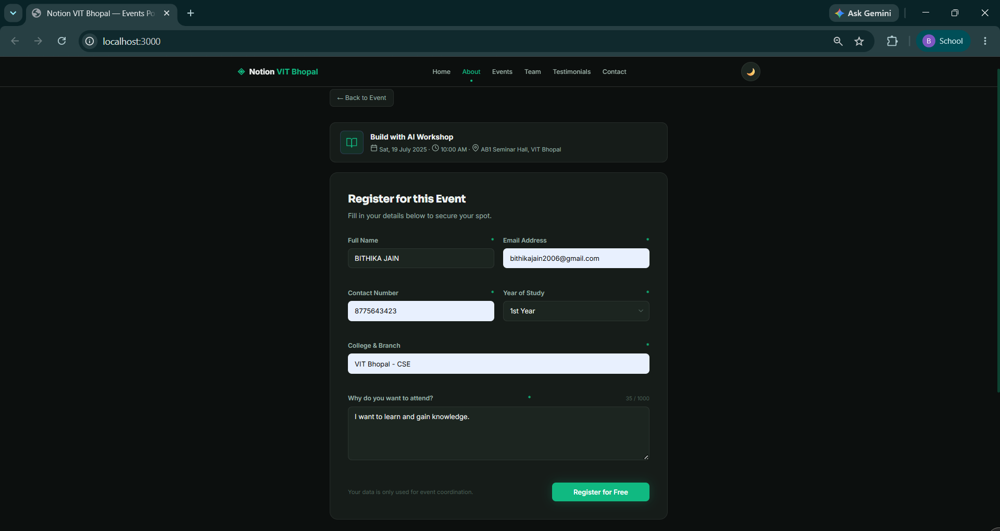
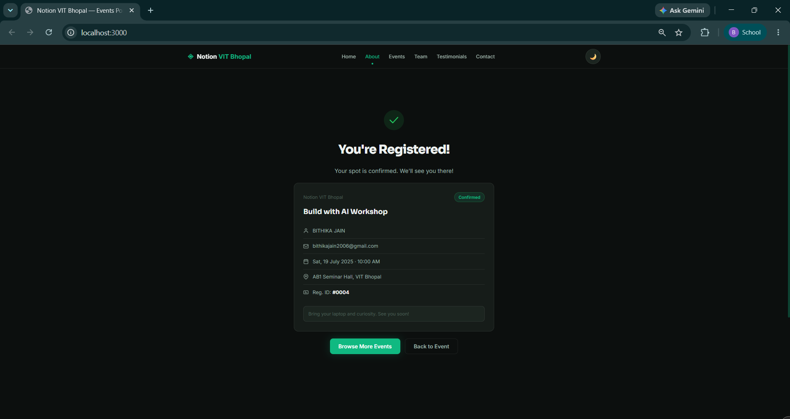

# Notion VIT Bhopal — Event Registration Portal

A full-stack event registration portal for **Notion VIT Bhopal** — a productivity and tech community at VIT Bhopal University.

## Live Demo

**[notion-event-registration-portal.vercel.app](https://notion-event-registration-portal.vercel.app)**

### Verify the Backend is Working

Open these URLs directly in your browser — each returns live JSON from the API:

| Endpoint | What it shows |
|----------|--------------|
| [/api/events](https://notion-event-registration-portal.vercel.app/api/events) | All 6 events (upcoming + past) |
| [/api/events/build-with-ai-2025](https://notion-event-registration-portal.vercel.app/api/events/build-with-ai-2025) | Single event with speakers & schedule |
| [/api/registrations](https://notion-event-registration-portal.vercel.app/api/registrations) | All participant registrations |
| [/api/events/build-with-ai-2025/registrations](https://notion-event-registration-portal.vercel.app/api/events/build-with-ai-2025/registrations) | Registrations for one event |

---

## Screenshots

| Home Page | Event Detail |
|-----------|-------------|
|  |  |

| Registration Form | Success Page |
|-------------------|--------------|
|  |  |

---

## Tech Stack

| Layer | Technology |
|-------|-----------|
| Frontend | HTML5, CSS3, Vanilla JavaScript (SPA) |
| Backend | Node.js + Express |
| Database | SQLite via sql.js (zero-config, file-based) |
| Deployment | Vercel |
| Fonts | Sora + Inter via Google Fonts |

---

## Project Structure

```
event-registration-portal/
├── public/                  ← Frontend (SPA)
│   ├── index.html           # Page shell — all sections in one file
│   ├── styles.css           # Full design system, dark/light theme
│   └── app.js               # Router, API calls, UI logic
│
├── server/                  ← Backend (Node.js + Express)
│   ├── index.js             # All API routes + Express app
│   └── database.js          # SQLite wrapper, schema, seed data
│
├── data/                    # Auto-created — holds portal.db (gitignored)
├── vercel.json              # Vercel deployment config
├── package.json
└── README.md
```

---

## Features

### Frontend
- Multi-event portal — upcoming and past events with filter tabs (All / Workshop / Bootcamp / Hackathon)
- Event detail pages — hero banner, live countdown timer, event status progress, speakers, day schedule, FAQ accordion
- Registration form with real-time client-side validation
- Success / confirmation page with registration ID
- Dark / Light theme toggle (persisted in localStorage)
- Scroll-reveal animations, glassmorphism cards, button ripple, hover prefetch
- Live registration feed ticker, circular seat availability ring
- Fully responsive — mobile, tablet, desktop
- Team section, Testimonials, Contact form with toast notifications

### Backend
- RESTful API with Express — 5 endpoints
- SQLite database — 4 tables: `events`, `speakers`, `schedule`, `registrations`
- Server-side input validation via `express-validator`
- Duplicate registration detection per event
- Past event registration blocking
- Seat limit enforcement
- 404 / 409 / 422 error handling

---

## API Reference

### Endpoints

| Method | Endpoint | Description |
|--------|----------|-------------|
| `GET` | `/api/events` | All events (upcoming + past) with seat counts |
| `GET` | `/api/events/:slug` | Single event with speakers & schedule |
| `POST` | `/api/events/:slug/register` | Register a participant |
| `GET` | `/api/events/:slug/registrations` | All registrations for an event |
| `GET` | `/api/registrations` | All registrations across all events |

### POST `/api/events/:slug/register`

**Request Body:**
```json
{
  "fullName": "Riya Sharma",
  "email": "riya@vitbhopal.ac.in",
  "contactNumber": "9876543210",
  "college": "VIT Bhopal — CSE",
  "year": "2",
  "whyAttend": "I want to learn how to build real-world AI applications..."
}
```

**Success Response (201):**
```json
{
  "success": true,
  "message": "Registration successful!",
  "data": {
    "id": 1,
    "fullName": "Riya Sharma",
    "email": "riya@vitbhopal.ac.in",
    "registeredAt": "2025-06-03 10:00:00",
    "event": { "title": "Build with AI Workshop", "date": "2025-07-19" }
  }
}
```

**Validation Rules:**

| Field | Rule |
|-------|------|
| fullName | Required, 2–100 chars, letters only |
| email | Valid format, unique per event |
| contactNumber | 10-digit Indian mobile (starts 6–9) |
| college | Required, 2–200 chars |
| year | One of: 1, 2, 3, 4, PG, PhD |
| whyAttend | Required, 20–1000 chars |

**Error Responses:**
- `422` — Validation failed (returns field-level errors)
- `409` — Email already registered for this event
- `409` — Event is fully booked
- `400` — Registrations closed (past event)
- `404` — Event not found

---

## Local Setup

### Prerequisites
- [Node.js](https://nodejs.org/) v18+
- npm

### Run Locally

```bash
# Clone the repo
git clone https://github.com/Bithika-Jain/notion-event-registration-portal.git
cd notion-event-registration-portal

# Install dependencies
npm install

# Start the server
npm start
```

Open **http://localhost:3000**

For development with auto-restart:
```bash
npm run dev
```

### Verify Backend Locally

```bash
# All events
curl http://localhost:3000/api/events

# Single event
curl http://localhost:3000/api/events/build-with-ai-2025

# All registrations
curl http://localhost:3000/api/registrations

# Submit a registration
curl -X POST http://localhost:3000/api/events/build-with-ai-2025/register \
  -H "Content-Type: application/json" \
  -d '{"fullName":"Test User","email":"test@vit.ac.in","contactNumber":"9876543210","college":"VIT Bhopal CSE","year":"2","whyAttend":"I want to learn practical AI skills to build real projects during this workshop."}'
```

---

## Database

SQLite file created automatically at `data/portal.db` on first run. Pre-seeded with:

**Upcoming:** Build with AI Workshop · Web3 & Blockchain Bootcamp · Notion Productivity Masterclass

**Past:** Open Source Sprint · UI/UX Design Crash Course · Python for Data Science

---

## Built By

**Notion VIT Bhopal** — VIT Bhopal's productivity & tech community

- Instagram: [@notion.vit](https://www.instagram.com/notion.vit/)
- LinkedIn: [Notion VIT](https://in.linkedin.com/company/notion_vit)
